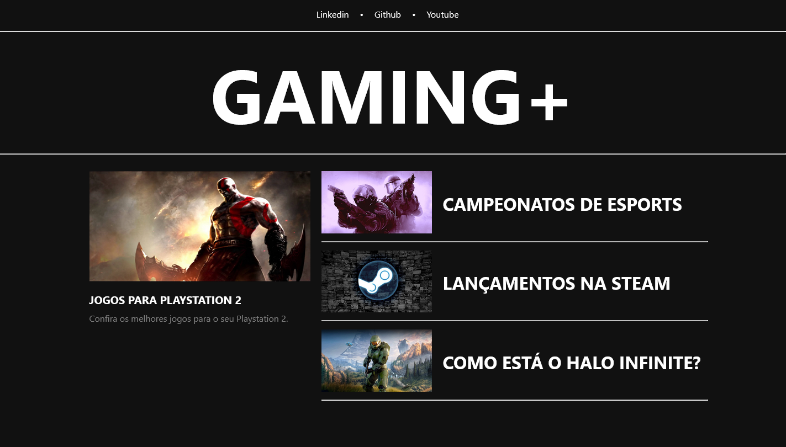

# 💻 Blog feito com Angular

## 📖 Descrição

Blog desenvolvido com o framework **Angular**, utilizando *HTML*, *CSS* e *Typescript*. Esse projeto foi desenvolvido durante o bootcamp da **NTT Data** na plataforma da **Digital Innovation One**.

Consiste em um pequeno blog com uma página principal, que contém as capas dos artigos com título e descrição. Esses links direcionam o usuário através das rotas, para acessar a página contendo o conteúdo.

Os dados utilizados são mockados localmente, através de um objeto, que armazena os dados básicos dos artigos do blog (capa, titulo e descrição). Cada publicação possui seu *id*, que serve para puxar os dados corretos dos artigos.

Sendo a primeira *framework* que tive contato, aprendi muitos conceitos novos, sendo um deles, os componentes, que facilitam a legibilidade e manutenção do código.

## 🔨 Ferramentas e Tecnologias

  
  
  
  
  
  

## 🖼️ Imagem do site

## 📌 Mais informações

Projeto desenvolvido durante o bootcamp da **NTT Data**, na plataforma da Digital Innovation One (DIO), durante as aulas do instrutor Felipe Aguiar.

## 🔗 Links

* [🔍 Angular Docs](https://angular.io/docs)
* [🔍 DIO](https://www.dio.me/)